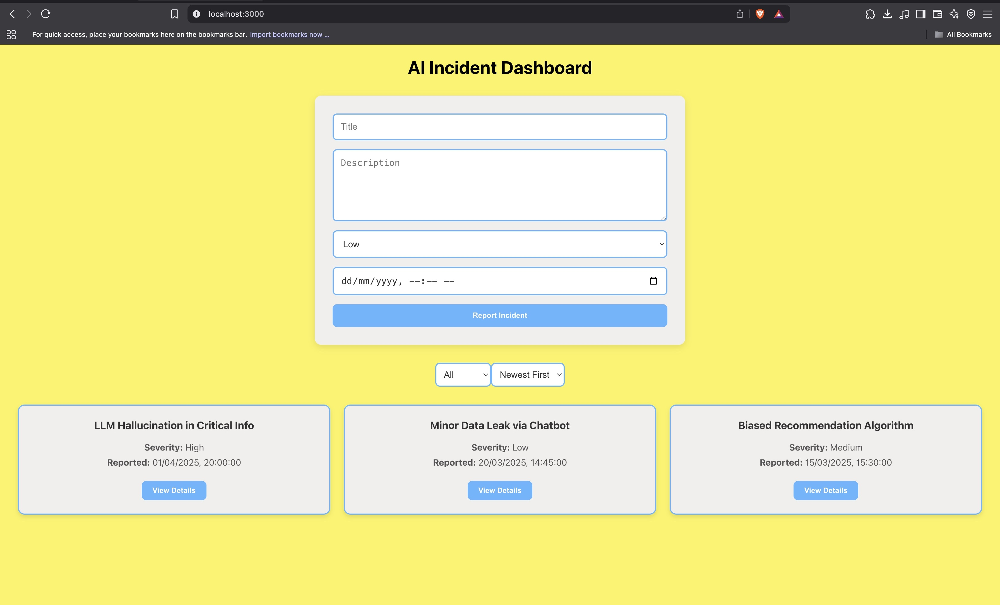

# AI Incident Dashboard



An interactive, responsive dashboard to view and report hypothetical AI Safety Incidents, built with **React**, **TypeScript**, **HTML**, and **CSS**.

---

## ✨ Features

- Display a list of AI safety incidents (Title, Severity, and Reported Date & Time).
- Filter incidents by severity (**All**, **Low**, **Medium**, **High**).
- Sort incidents by Reported Date (**Newest First**, **Oldest First**).
- Expand/Collapse each incident to view the full **Description**.
- Report a new AI safety incident via a form with basic **form validation**.
- Responsive layout using **Flexbox** for mobile and desktop screens.
- Clean, simple, and user-friendly design.

---

## 📋 Technologies Used

- React (with TypeScript)
- HTML5
- CSS3 (custom)
- Local component state management (No backend)

---

## 🚀 Getting Started

### Prerequisites
- Node.js (v14 or above) and npm installed.

### Installation

1. Clone the repository:
   ```bash
   git clone https://github.com/your-username/ai-incident-dashboard.git
   cd ai-incident-dashboard
2. Install dependencies:

``` bash
npm install
```

3.Start the development server:

```bash
npm run dev
```
or
```bash
npm start
```
4. Open http://localhost:3000 in your browser to view the app.

